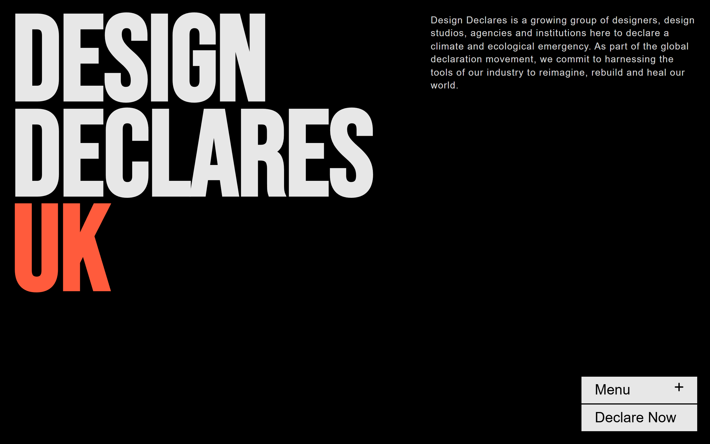

#  Design Declares Clone – Frontend Web Task

This is a high-fidelity, animated React + SCSS front-end clone of [Design Declares](https://designdeclares.com/) built for a company as a task submission. The project replicates key visual sections, including layout, animations, responsive behavior, and scroll effects across multiple country-based pages.

##  Highlights

-  **Pixel-Perfect UI** using custom SCSS and Flexbox/Grid layout
-  **Reusable Components**: Header, Footer, Menu, Country Pages,Checkbox etc.
-  **Props-Driven Architecture**: For country-specific content and style overrides
-  **Framer Motion Animations**: Smooth scroll and reveal effects
-  **Fully Responsive** across devices
-  **Multi-Page Routing** using React Router v6
-  **Designed and built** under **time constraints** with focus on UI & interaction fidelity

##  Tech Stack

- **React** (with functional components and hooks)
- **SCSS** (modular with BEM-inspired structure)
- **Framer Motion** for animation
- **React Router** for navigation
- **Vercel** for deployment

##  Getting Started

1. Clone the repository:
   git clone https://github.com/GourinandhanaES/fitpeo-web.git
2. cd fitpeo-web
3. npm install
4. npm run dev

## Live demo
👉 [Live Demo](https://fitpeo-web.vercel.app/)

## Screenshots
### 🖥️ Desktop View

 This project primarily focuses on design implementation and UX fidelity. Form functionality and backend integrations are not fully implemented.
